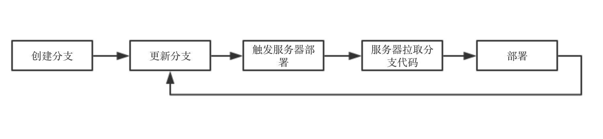
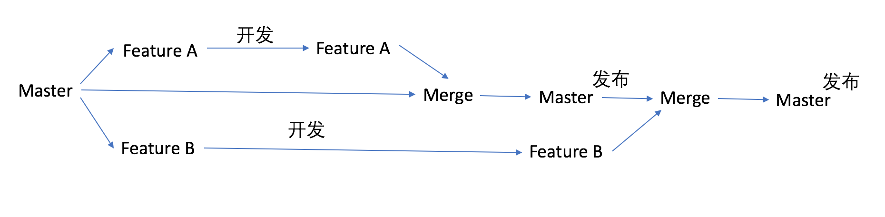

## 前端工程化—部署

使用脚手架创建初始项目，在本地搭建开发服务器进行项目开发。编码完成后，经过构建生成目标环境可用的代码，到此阶段的所有工作都属于开发环节。下一步的工作需要将代码部署到指定的环境中，方便进一步的联调测试工作。

在部署一些个人项目或者小团队的项目时，可能就是使用一些工具（如FTP上传工具）将文件上传到指定的服务器，然后交给运维人员发布上线即可。
这种发布方式简单快速，适合于个人项目或者小规模团队。但是对于用户量庞大的产品和拥有多种开发体系的技术团队，项目部署必须考虑**协作、速度、安全**等多方面因素，需要一套完整的流程实现项目部署。

先来看三个场景，从实际场景出发考虑前端部署需要注意哪些因素。

1、开发人员使用FTP工具上传代码到服务器。在测试阶段，测试人员提了一个Bug给开发同学，开发人员修复完成后需要打开FTP工具，定位到指定目录然后上传代码。每次的Bug修复都需要重复这个过程。

2、多人协作的项目中，如果A同学在修复一个Bug后没有将代码提交到代码仓库，其他开发在旧代码基础上进行改动，部署后发现A修复的Bug又出现了。

3、开发同学失误将代码部署到其他应用的目录中，导致其他应用功能故障。

以上三个场景分别对应了部署流程中需要考虑的3个因素：速度、协作和安全。不同结构、不同规模的团队有着不同的侧重点，小团队注重速度，大团队注重于协作和安全。

### 部署工具

针对场景1中的速度问题，我们需要一个自动化的**部署工具**，工具必须可配置且操作简单。
* **可配置化**：部署的目标服务器、路径信息与项目一一对应，可供运维人员部署。
* **操作简化**：部署操作应该实现自动化，开发人员通过命令行或者可视化页面部署项目。
集团的Aone平台已经实现了高度的自动化，开发人员只需要申请测试环境，然后点击部署项目即可进行测试。背后的服务器资源分配、项目构建、项目资源部署都无需开发人员关注。

### 部署流程
针对场景2中的写作问题，我们需要一个完善的**部署流程**。
场景2中存在两个问题：沟通不及时导致代码不同步；控制不严格导致部署内容错误覆盖。

首先我们需要完善分支管理机制，多人开发的项目使用版本控制系统Git，本地的项目不能直接部署到服务器上，服务器部署是从Git仓库中拉取分支代码，要想在服务器上部署必须将代码推送到Git仓库中。

 

开发者可以申请多个日常环境部署自己的项目分支，但是要保证每个项目的预发环境中只能有一个或者两个分支。发布必须以队列的形式进行发布，而且发布队列中只能有一个项目分支，从而保证项目内容不会被错误覆盖，都是最新的代码。
以Git为例，多人协作的项目中，都是从master分支创建feature进行开发，在日常环境中可以部署自己的feature分支，但是在预发部署时，必须merge master的代码，否则预发编译报错，发布必须从预发队列发布。
 

简单来说，部署队列就是将所有的部署请求按顺序排成一个队列，必须依次完成发布，且每次发布之前对流程进行卡点。必须保证预发功能验证通过，代码安全性扫描通过，code review通过，否则不允许项目发布。

### 权限体系
对于场景3中的安全问题，我们需要建立**权限体系**。
开发人员只保留请求部署的权限，项目部署到哪台服务器、具体路径以及部署的环境等信息对于开发人员来说是透明的，所以开发人员只需要关注业务即可。项目的部署到目标服务器和目标地址的过程应该使用代码或者脚本自动化完成，减少人为因素造成的误操作。

### 前端静态资源部署
在设计部署流程的时候，需要考虑到的是前端领域和其他领域最大的区别是前端资源都是静态资源，其中最特殊的就是HTML文件。

HTML文件是Web网站的唯一入口，所有其他资源必须由html文件直接或者简介引用才能被夹在。HTML的特殊性决定了它只能使用协商缓存，其他资源（Js、CSS等）应使用强缓存。这种缓存策略保证用户每次访问网站能够获取到最新的HTML资源，其他静态资源的更新能够直接体现在HTML中，只要HTML及时更新，就保证了全站资源的更新。可以在服务器中针对不同的静态资源设置不同的缓存策略。

HTML和其他静态资源应部署在不同的域名下，有两个好处：
* 如果部署在统一域名下，请求静态资源（Js、CSS）时也会携带cookie，浪费资源，将这些静态资源部署在另一个域名下，就解决了这个问题。
* Js、CSS等文件可以部署在CDN中，优化网站性能。

### 总结
以上所述都是前端工程化部署中需要考虑的一些基本问题，实施过程中还有很多细节需要考虑，例如代码回滚机制、部署队列优先级处理、权限体系中的黑白名单策略等，但是在设计部署方案时，一定要考虑**速度、协作和安全**三个因素，然后设计最适合自己团队的具体方案。

### 参考资料
* [大公司里怎样开发和部署前端代码？](https://github.com/fouber/blog/issues/6)

