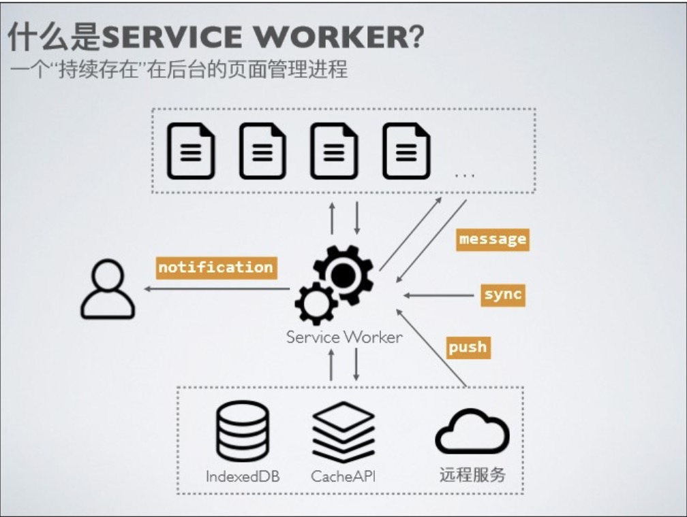
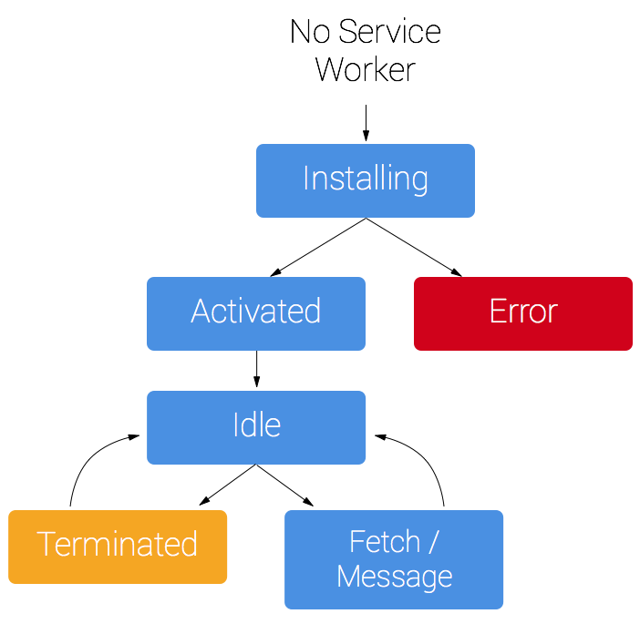

### 了解Service Worker
#### 作用
* 拦截页面请求
* 缓存静态资源

#### 特征
* 独立线程
* 生命周期
* 作用域
* API全部是异步
* 只能运行在HTTPS或者localhost环境
* postMessage进行通信

#### 生命周期

独立于页面，不随页面销毁而销毁。

* intalling: 执行Service Worker
* activated: Service Worker加载成功
* idle/terminated: 是否在运行。
  * 收到message/fetch之类的消息，浏览器会将Service Worker的状态改为idle。
  * 页面关闭，Service Worker变为terminated状态以释放内存。

#### 事件
* install和activate是生命周期的事件
* message：发送和接收消息（比较老的方式，最新的api推荐使用push）
* fetch：拦截请求
* sync：后台同步
* push：发送和接收消息，页面之间的通信、Service Worker之间的通信。

#### 适用场景
* 流量大的页面
  
如果前端应用流量很小，做service worker的缓存方案价值就不大，因为它主要是二次访问的时候才能带来价值。

不需要花费过高的成本追求过分的极致，但是也不能让用户等待太久。

#### 关键技术
* Cache：https://developer.mozilla.org/zh-CN/docs/Web/API/Cache
* Web App Manifest
* Push&Notification
* Background Sync

