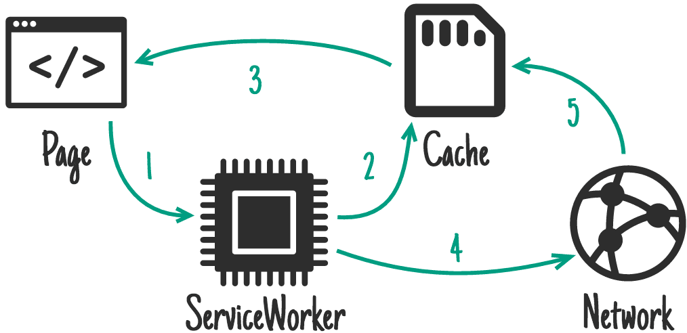

## workbox

workbox是PWA相关的工具集合，它是Google官方的PWA框架，它解决的就是用底层API写PWA太过复杂的问题。  
围绕它的还有一些列工具，如 workbox-cli、gulp-workbox、webpack-workbox-plagin等。

### 特点
* 不管你的站点是何种方式构建的，都可以为你的站点提供离线访问能力。
* 就算你不考虑离线能力，也能让你的站点访问速度更加快。
* 几乎不用考虑太多的具体实现，只用做一些配置。
* 简单却不失灵活，可以完全自定义相关需求（支持 Service Worker 相关的特性如 Web Push, Background sync 等）
* 针对各种应用场景的多种缓存策略

### 缓存策略
#### workbox缓存策略 
**Stale-While-Revalidate**


**Cache First**


**Network First**


**Network Only**


**Cache Only**


#### 业务中的缓存策略
* HTML：
  * 如果页面需要离线可以访问，使用NetworkFirst；
  * 如果不需要离线访问，使用 NetworkOnly，其他策略均不建议对HTML使用。
* JS、CSS：
  * 使用Stale-While-Revalidate策略，保证页面速度，即便失败，用户刷新一下即可更新。SW无法办法判断从CDN上请求下来的资源是否正确（HTTP 200），如果缓存了失败的资源，导致页面无法正常访问。
  *  CSS、JS与站点在同一个域下，并且文件名中带了Hash版本号，可以使用Cache First策略。
* 图片：
  * Cache First，并设置一定的失效事件，请求一次就不会再变动
* 其他：
  * 对于一些基础JS，例如react、polyfill等文件，可以用prefetch
  * 对于不在同一域下的任何资源，绝对不能使用Cache only和Cache first

#### 跨域请求的缓存
针对跨域请求的缓存，因为 Workbox 无法获取跨域请求的状态，当请求失败的情况下 workbox也只能选择缓存错误的结果，所以workbox 3原则上默认不会缓存跨域请求的返回结果，但是networkFirst和stalteWhileRevalidate缓存策略可以生效。  

如果需要缓存跨域请求，可以用workbox.cacheableResponse.Plugin来指定只缓存请求成功的结果。

``` javascript
workbox.routing.registerRoute(
    'https://notzoumiaojiang.com/example-script.min.js',
    workbox.strategies.cacheFirst({
        plugins: [
            // 这个插件是让匹配的请求的符合开发者指定的条件的返回结果可以被缓存
            new workbox.cacheableResponse.Plugin({
                statuses: [0, 200]
            })
        ]
    }),
);
```

### 更新机制

``` javascript
workbox.skipWaiting();
workbox.clientsClaim();
```


### 参考
* [神奇的 Workbox 3.0 - 让你的 Web 站点轻松做到离线可访问](https://juejin.im/entry/6844903552335233031)
* [workbox-webpack-plugin 插件相关](https://github.com/cisen/blog/issues/655)
