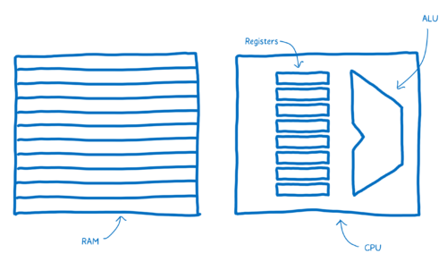
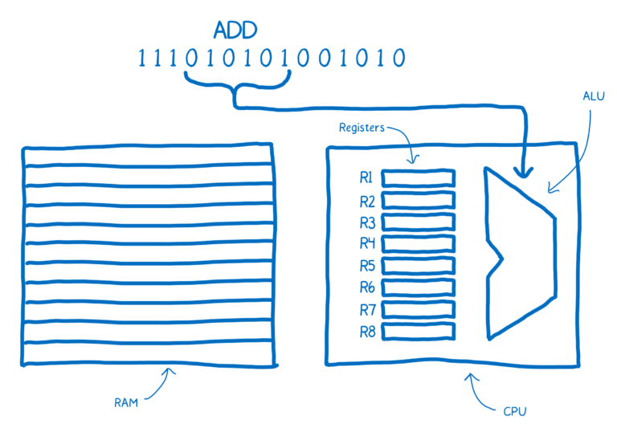
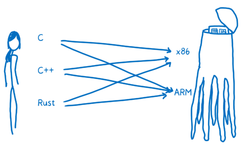
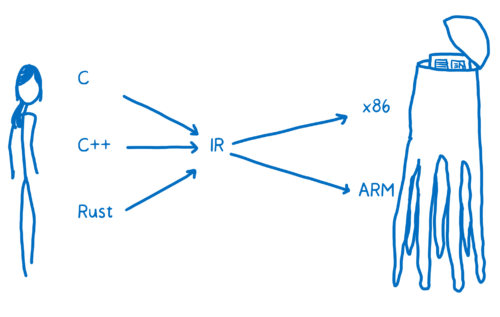

## assembly

我们来思考下计算机是如何运行程序代码的。我们都知道计算机有两个重要的组成部分：CPU和内存。

CPU由控制器、运算器、寄存器组成；内存由RAM、ROM、Cache组成。

我们把一段机器码称为一个指令，当一个指令进入CPU时，会发生什么呢？

例如CPU可能总是把前6位机器码传送给运算器，运算器就知道需要将两个数进行相加。这个字段就是操作码，告诉运算器要执行的操作。

接下来CPU会取后面两个三字节字段的值来相加，这两个数会存在寄存器中。

上图中机器码上的注释就是汇编。相对于机器码来说，汇编更易于我们理解。也被称为符号机器码，符号机器码有助于人类理解。

就像人类语言一样，机器码也不止一种语言。

所以我们需要把java、rust、go、js等高级语言转换成ARM、x86等。一种方法是创建一整套从不同高级语言到不同汇编语言的体系。

但是这样十分低效。大部分编译器会在中间放置一个一个中间层，编译器把高级语言转化成相对底层的形式，转化后的代码不能像机器码一样直接运行。这种形式称为IR。

这意味着编译器可以把任何一种高级语言编译成IR，然后编译器的另一部分实现IR到不同汇编语言的转换。