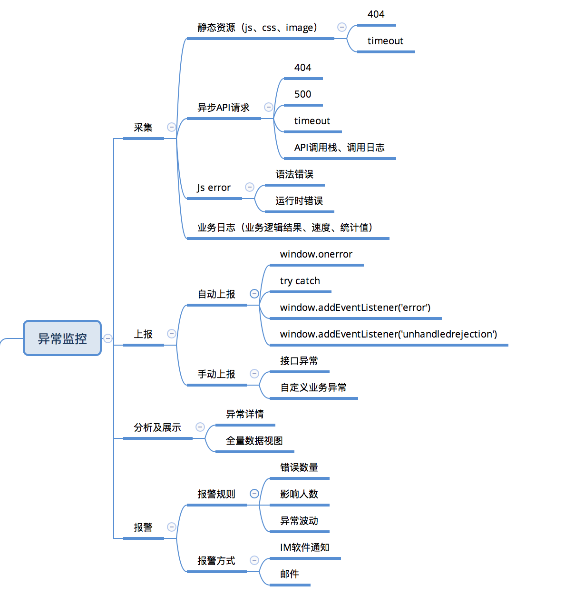
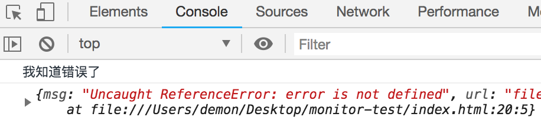
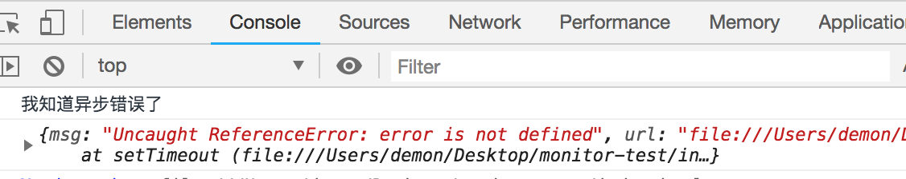
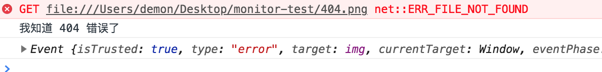
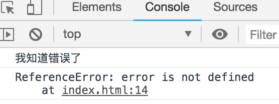
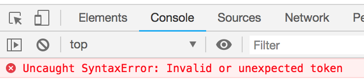
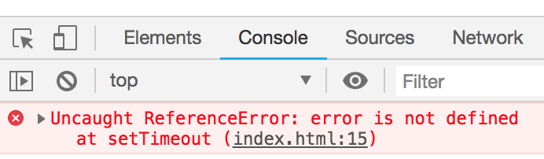
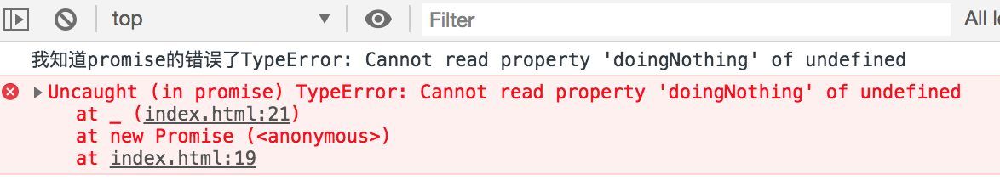

## 异常监控

### 前端异常是什么？
前端是离用户最近的一层，随着产品的日益成熟，前端应用系统也越来越复杂，容易出现不可控的异常，影响用户体验。主要包括以下类型。

* JS代码异常
	* 语法错误
	* 运行时错误
* Promise异常
* 跨域Script error
* Iframe异常
* AJAX请求异常
* 静态资源加载异常

Javascript异常不会导致Js引擎崩溃，最多只是使当前执行的任务终止。
* 当前代码块将作为一个任务压入任务队列中，JS 线程会不断地从任务队列中提取任务执行。
* 当任务执行过程中出现异常，且异常没有捕获处理，则会一直沿着调用栈一层层向外抛出，最终终止当前任务的执行。
* JS 线程会继续从任务队列中提取下一个任务继续执行。

``` javascript
<script>
  error
console.log('永远不会执行');
</script>
<script>
  console.log('还是会执行');
</script>
```


### 为什么要做异常监控？
* 开发阶段做了“足够的”测试，上线后还是会在某些情况下出现错误或异常，被动等到用户反馈。
* QA汇报错误后，开发难于快速定位问题。

### 前端异常监控怎么做？

前端异常监控系统主要包括：异常信息采集、异常上报、异常分析、异常报警等主要功能。



搭建前端异常监控系统是一个复杂的工作，需要考虑很多细节，下面列举了几个关键问题作为参考。

* 前端SDK需要实现：错误拦截，代理监控，上报策略，API设计，以及日志接口设计。
* 上报的日志实现实时查询。
* 监控日志可视化管理后台的开发。
* 压缩后的单行文件如何定位源码错误。

#### 异常捕获

##### 1. `window.onerror`

``` javascript
window.onerror = function(message, source, lineno, colno, error) { ... }
```

可以捕捉语法错误，也可以捕捉运行时错误；能拿到出错的信息：堆栈、出错的文件、行号、列号；
当window.onerror函数返回true时，错误信息就不会向上抛出。

缺点：
* 无法捕捉try catch块，当前代码块有错误，JS不会执行，无法捕捉错误。
* 无法捕捉全局错误事件。

注意点：
* window.onerror处理函数不能和代码在一个模块中，否则语法错误，处理函数不会执行。应该将处理函数放在另一个文件中，并且先于代码执行。
* 无法捕捉网络异常，网络异常不会向上冒泡。

**运行时同步错误**

``` javascript
window.onerror = function (msg, url, row, col, error) {
  console.log('我知道错误了');
  console.log({
	msg,  url,  row, col, error
  })
  return true;
};
error
```


**运行时异步错误**

``` javascript
window.onerror = function (msg, url, row, col, error) {
  console.log('我知道异步错误了');
  console.log({
	msg,  url,  row, col, error
  })
  return true;
};
setTimeout(() => {
  error;
});
```


**捕获阶段监听网络错误**

``` javascript
<script>
  window.addEventListener('error', (msg, url, row, col, error) => {
  console.log('我知道 404 错误了');
  console.log(
	msg, url, row, col, error
  );
  return true;
}, true);
</script>

```


##### 2. try catch

用`try catch`对代码块进行包装后，当代码块发生错误是catch能捕捉错误的信息，页面也可以继续执行。`try catch`可以拿到出错的信息：堆栈、出错的文件、行号、列号，但只能捕获运行时同步错误。

缺点：
* 无法捕捉全局错误，无法捕捉语法错误，只能捕捉运行时错误。
* 无法捕捉异步错误

**运行时错误**
``` javascript
try {
  error    // 未定义变量 
} catch (e) {
  console.log('我知道错误了');
  console.log(e);
}
```


**语法错误**
```
try {
  var test = 'error'；   // 大写分号
} catch (e) {
  console.log('我感知不到错误');
  console.log(e);
}
```


**异步错误**

``` javascript
try {
  setTimeout(() => {
	error        // 异步错误
  })
} catch (e) {
  console.log('我感知不到错误');
  console.log(e);
}
```


框架的异常捕获


##### 3. addEventListener
通过`Promise`可以帮助我们解决异步回调地狱的问题，但是一旦`Promise`实例抛出异常而你没有用`catch`去捕获的话，`onerror`或`try-catch`也无能为力，无法捕捉到错误。

书写Promise时一定要加上catch进行异常处理，如果没有处理，可以通过`unhandledrejection`监听异常。

``` javascript
window.addEventListener('unhandledrejection', function (event) {
  const error = event && event.reason
  console.warn('我知道promise的错误了' + error)

  // ... report error
})

const somePromise = new Promise(_ => {
  let a
  a.doingNothing // 空指针，出错啦！！！
})

somePromise.then(console.log)
```


##### 4. 扩展异步接口

在异步请求接口中添加异常处理函数。

##### 5. 其他注意点

**script error**

HTML与script不同域，浏览器为了防止泄漏敏感信息，对异常内容和位置信息做处理。

解决：script标签添加crossorigin=anonymous属性，服务端需要设置access-control-allow-origin

**iframe报错**

* 同域名：监听iframe上window.onerror
* 不同域名：跨域通信传递异常信息

#### 异常上报

异常上报方式

* 通过Ajax发送数据
* 动态创建img标签的形式

``` javascript
function report(error) {
  var reportUrl = 'http://xxxx/report';
  new Image().src = reportUrl + 'error=' + error;
}
```

#### 异常分析

异常分类：
* 静态资源错误
* 接口异常
* 异常事件

分析方式：
* 柱状图看波动，饼状图看分布
* 统计用户浏览器、IP等信息

### 常见问题
* 报警疲劳度：过滤、降级
* 大型网站数据量大：抽样上报、合并上报、延迟上报
* 压缩脚本异常定位：Sourcemap

## Results
* 建立前端应用异常case追踪定位列表，抽象通用异常case，解决日常开发中类似的问题，提高修复效率。
* 生成异常数据报表，分析前端应用健康度。

## References
* [JavaScript 异常档案](https://saijs.github.io/wiki/)
* [把前端监控做到极致: 监控组件的思考与组合](https://www.atatech.org/articles/128975)
* [浏览器端 JavaScript 异常监控-刘小杰](https://myslide.cn/slides/1031)
* [前端代码异常监控实战](http://web.jobbole.com/93684/?utm_source=blog.jobbole.com&utm_medium=relatedPosts)
